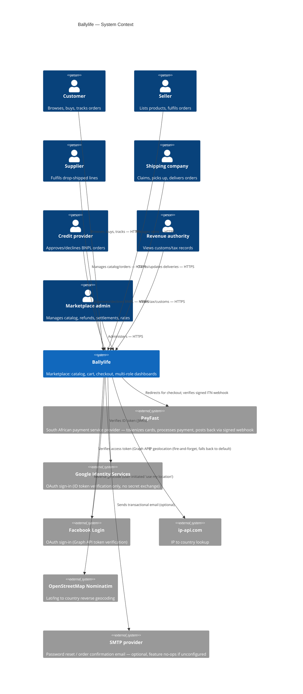
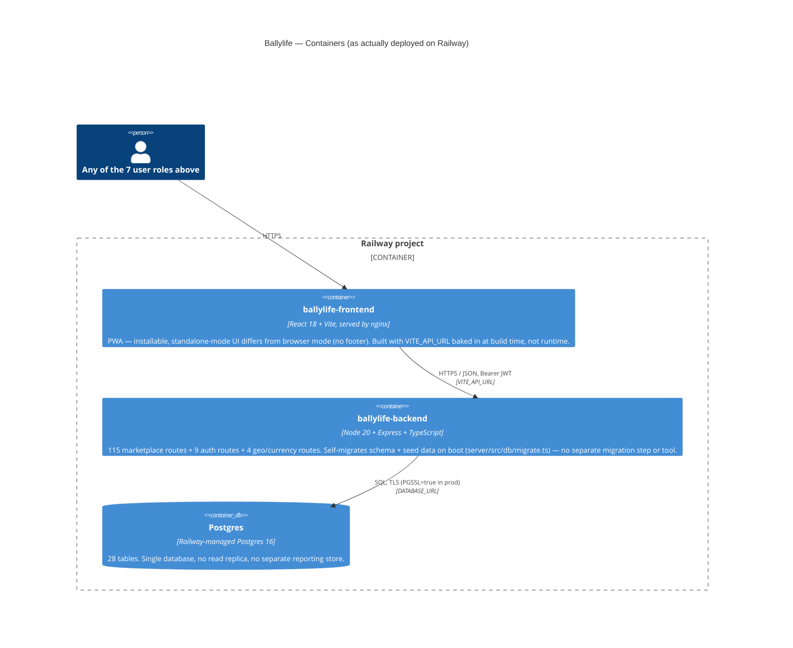

# Architecture

This reflects what's actually deployed (verified against `server/src/index.ts`,
`Dockerfile`, `server/Dockerfile`, and Railway's live service list as of Phase 0/1
of the audit this document came out of) — not an aspirational target.

## C4: System Context

## C4: Container

## What this is not (yet)

- **No API gateway / BFF layer** — the frontend calls `marketplaceRouter`/`authRouter`/`geoRouter` directly. Fine at current scale; would need revisiting before adding a second frontend (e.g. a real native mobile app) that wants a different API shape.
- **No message queue / async job runner** — everything is a synchronous HTTP request-response. There is no background worker for, e.g., retrying a failed supplier-payout webhook or batching settlement runs. `mkt_order_line_settlements` rows are updated in place by admin action, not by a scheduled job.
- **No cache layer** (Redis or similar) — every catalog request hits Postgres directly. At 200k+ products this is worth watching if traffic grows; not an issue at current load.
- **No CDN in front of the frontend** beyond whatever Railway/nginx does by default — static assets aren't fronted by a separate CDN.
- **Single region** — Railway's `sfo` region for Postgres (per the volume region seen in deploy status); no multi-region failover.

## Auth architecture (as built)

Two **separate** JWT-based auth systems exist in this codebase's broader monorepo history: Ballylife's own (`server/src/middleware/auth.ts`, `MARKETPLACE_JWT_SECRET`) and VINK-GRUP-LIMITED's (a different, unrelated system) — deliberately non-interchangeable secrets so a token from one is never valid on the other. This document only covers Ballylife's.

- Stateless JWT, 8-hour expiry (`JWT_EXPIRES = "8h"` in `auth.ts`), no refresh-token rotation implemented.
- Role carried in the JWT payload itself (`customer | seller | marketplace_admin | supplier | revenue_authority | shipping_company | credit_provider`), checked via `requireRole(...)` middleware — not re-fetched from the database per request. **Consequence**: if an admin's role is downgraded, their existing token remains valid with the old role until it expires (up to 8 hours) or they log out. No token revocation list exists.
- OAuth (Google/Facebook) issues the same JWT shape as password login — see `docs/threat-model.md` for how identity-linking-by-email is handled there.
