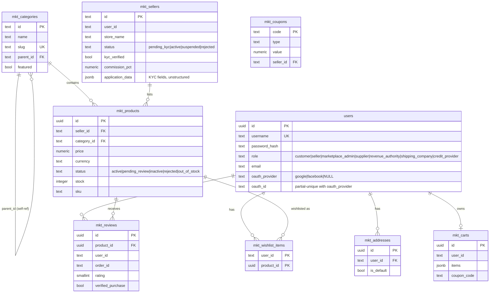
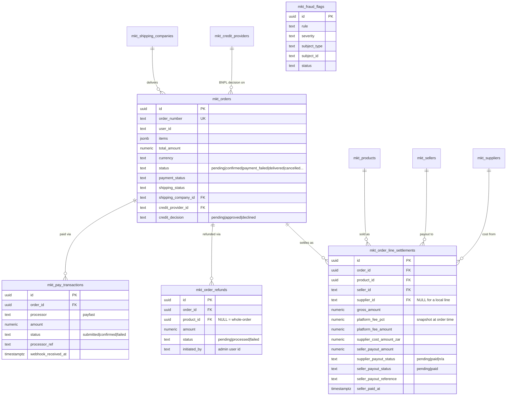
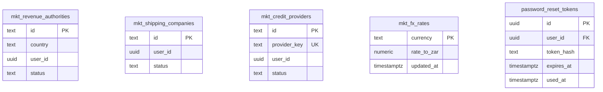

# Entity Relationship Diagram

28 tables total (`grep -c "CREATE TABLE" server/src/db/schema.sql`). Grouped into
four diagrams by concern rather than one unreadable 28-entity graph. Every
column shown here was read directly from `server/src/db/schema.sql`, not
inferred.

## 1. Core commerce

## 2. Orders, payments, settlement (the closest thing to a ledger — see below)

## 3. Supply chain / logistics

```mermaid
erDiagram
  mkt_suppliers ||--o{ mkt_supplier_products : catalogs
  mkt_supplier_products ||--o{ mkt_supplier_orders : "sourced as"
  mkt_warehouses ||--o{ mkt_shipments : "origin/destination"
  mkt_shipments ||--o{ mkt_supplier_orders : carries
  mkt_shipments ||--o{ mkt_customs_records : "declared as"
  mkt_categories ||--o{ mkt_duty_rates : "rate for"

  mkt_suppliers {
    text id PK
    text country
    text platform
    bool dropship_supported
    bool verified
  }
  mkt_supplier_products {
    uuid id PK
    text supplier_id FK
    numeric cost_price
    numeric retail_price
    integer moq
    text status
  }
  mkt_warehouses {
    text id PK
    text country
    text type
  }
  mkt_shipments {
    uuid id PK
    text origin_warehouse_id FK
    text destination_warehouse_id FK
    text status
    timestamptz customs_cleared_at
  }
  mkt_supplier_orders {
    uuid id PK
    uuid order_id FK
    uuid product_id FK
    text supplier_id FK
    uuid shipment_id FK
    text status
  }
  mkt_customs_records {
    uuid id PK
    uuid shipment_id FK
    numeric declared_value
    numeric duty_amount
    numeric vat_amount
    text status
  }
  mkt_tax_rates {
    text country PK
    numeric vat_rate_pct
    numeric default_duty_rate_pct
  }
  mkt_duty_rates {
    uuid id PK
    text country
    text category_id FK
    numeric duty_rate_pct
  }
  mkt_vehicle_duty_zm {
    uuid id PK
    text body_type
    text age_band
    numeric duty_kwacha
  }
```

## 4. Platform roles & rates

## Ledger design — what actually exists, honestly

**There is no formal double-entry ledger.** No debit/credit pairs, no
append-only enforcement at the database level, no derived-balance-from-
immutable-events model. This section says what actually exists in its place,
not what a bank would need.

`mkt_order_line_settlements` is the closest thing to one, and it's a real,
deliberate design — one row per (order, product line), capturing at order
time:
- `gross_amount` (what the customer paid for that line)
- `platform_fee_pct` / `platform_fee_amount` (Ballylife's cut, snapshotted —
  changing a seller's `commission_pct` later doesn't retroactively change
  already-settled rows)
- `supplier_cost_amount` / `supplier_cost_amount_zar` (converted via
  `mkt_fx_rates` at order time, for drop-shipped lines)
- `seller_payout_amount` (gross − platform fee − supplier cost)
- Two independent status fields — `supplier_payout_status` and
  `seller_payout_status` — each `pending → paid`, moved by an admin action,
  not a scheduled job.

**What this gets right**: money math is computed once, at order time, and
stored — not recomputed live from `mkt_orders.total_amount` every time
someone views a settlement report. That's the right instinct; it means a
later rate change can't silently reshuffle historical numbers.

**What this doesn't have, that a stricter design would**:
1. **Mutability.** `seller_payout_status` is `UPDATE`d in place when an
   admin marks something paid. There's no append-only event log recording
   *who* changed it and *when*, beyond `seller_paid_at`/`seller_payout_reference`
   on the row itself — if a status gets flipped back by mistake, the
   previous state is gone, not superseded by a new immutable row.
2. **No reconciliation table.** There's nothing that periodically checks
   "sum of confirmed `mkt_pay_transactions.amount` for this order equals
   `mkt_orders.total_amount` equals sum of this order's
   `mkt_order_line_settlements.gross_amount`" and flags a mismatch. Today
   that invariant holds only because the code that writes all three is
   careful, not because anything enforces it.
3. **No idempotency key on settlement creation** distinct from the order
   itself — a retry that somehow ran settlement-creation twice for the same
   order would need to be caught by application logic, not a unique
   constraint (there's no `UNIQUE(order_id, product_id)` on
   `mkt_order_line_settlements` as of this schema read).

None of this is wrong for a marketplace moving money through a licensed PSP
(PayFast) rather than holding funds directly — it's a reasonable design for
what Ballylife actually is. It would be wrong to present it as bank-grade
double-entry bookkeeping, which is why this section says plainly that it
isn't one.
